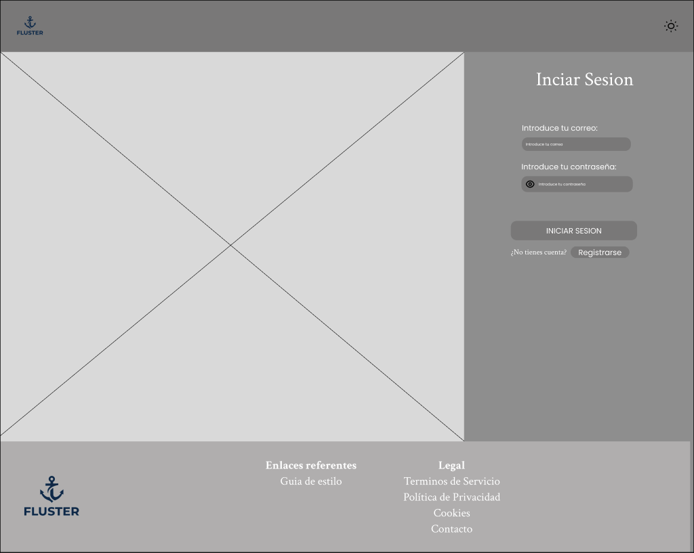
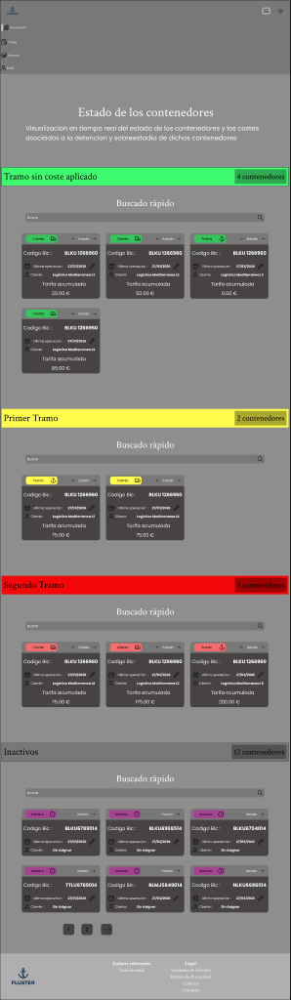
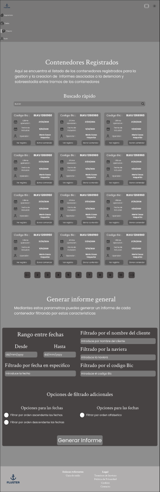
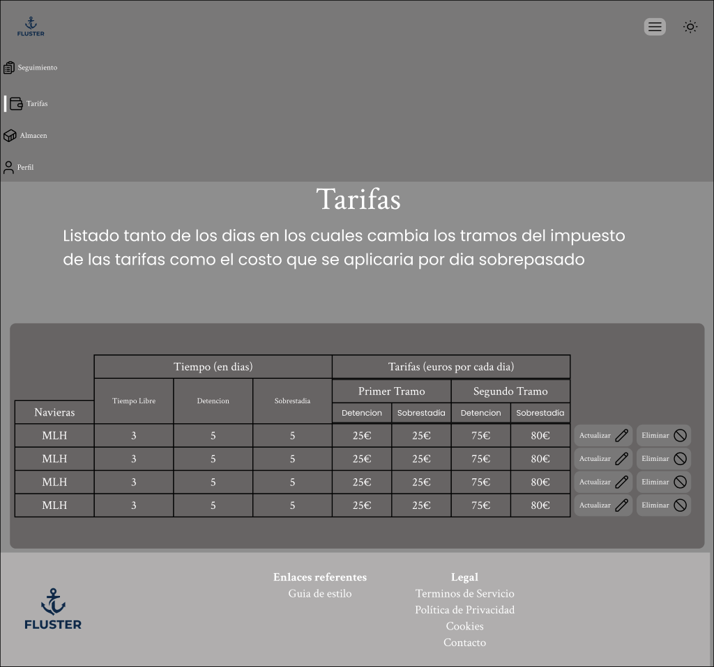
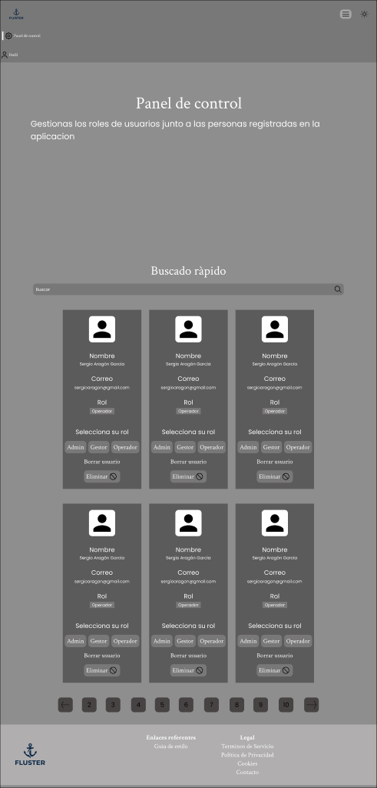

# Guía de Estilos — Fluster

## Índice

1. [Prototipo en Figma](#1-prototipo-en-figma)
2. [Arquitectura CSS — ITCSS](#2-arquitectura-css--itcss)
3. [Metodología de nombrado — BEM](#3-metodología-de-nombrado--bem)
4. [Diseño Atómico](#4-diseño-atómico)
5. [Sistema de temas (light/dark)](#5-sistema-de-temas-lightdark)
6. [Paleta de colores](#6-paleta-de-colores)
7. [Tipografía](#7-tipografía)
8. [Espaciado](#8-espaciado)
9. [Otros tokens de diseño](#9-otros-tokens-de-diseño)
10. [Guía de uso práctica](#10-guía-de-uso-práctica)

---

## 1. Prototipo en Figma

El proyecto de diseño se encuentra en Figma e incluye tres artefactos diferenciados:

| Artefacto | Enlace | Descripción |
|-----------|--------|-------------|
| **Archivo de diseño** | [Proyecto — Fluster](https://www.figma.com/design/Jf6d7039UDcHaFClx7Rlby/Proyecto---Fluster?node-id=0-1) | Archivo principal con todas las pantallas, componentes y sistema de diseño |
| **Prototipo interactivo** | [Prototipo navegable](https://www.figma.com/proto/Jf6d7039UDcHaFClx7Rlby/Proyecto-Fluster?node-id=4-5&page-id=4%3A5&starting-point-node-id=694%3A10274&scaling=min-zoom&content-scaling=fixed) | Flujo completo de la aplicación con navegación interactiva entre pantallas |
| **Wireframes** | [Wireframes](https://www.figma.com/proto/Jf6d7039UDcHaFClx7Rlby/Proyecto-Fluster?node-id=4-3&page-id=4%3A3&starting-point-node-id=170%3A494&scaling=min-zoom&content-scaling=fixed) | Bocetos de baja/media fidelidad con la estructura de las pantallas principales |

El prototipo recoge las pantallas principales de la aplicación, los estados interactivos de los componentes y el sistema de diseño alineado con los tokens descritos en esta guía.

### Wireframes principales

Los wireframes de baja/media fidelidad recogen la estructura y jerarquía de cada pantalla antes de aplicar el sistema visual definitivo.

| Pantalla | Wireframe |
|---|---|
| **Login** |  |
| **Semáforo** |  |
| **Almacén** |  |
| **Tarifas** |  |
| **Panel de control** |  |

---

## 2. Arquitectura CSS — ITCSS

### ¿Qué es ITCSS?

ITCSS (Inverted Triangle CSS) es una metodología de arquitectura CSS que organiza las hojas de estilo en capas ordenadas de **menor a mayor especificidad**. La metáfora del triángulo invertido ilustra que las reglas más genéricas y de menor peso se sitúan en la base (que es ancha), mientras que las más específicas se concentran en el vértice superior (que es estrecho).

```
   ──────────────────────────────────────────
  ──────  00 Settings  (variables, sin CSS)  ──────
 ────────────  01 Tools  (mixins, sin CSS)  ────────────
─────────────────  02 Generic  (reset, normalize)  ─────────────────
───────────────────────  03 Elements  (etiquetas HTML)  ───────────────────────
─────────────────────────────  04 Layout  (estructura de página)  ─────────────────────────────
────────────────────────────────────────  05 Components  (componentes específicos)  ────────────────────────────────────────
──────────────────────────────────────────────────  06 Utilities  (clases de apoyo de alta especificidad)  ──────────────────────────────────────────────────
```

La base del triángulo (anchura máxima) representa el alcance global: las reglas afectan a todos los elementos. El vértice superior representa el alcance local: las reglas afectan a un único elemento o estado concreto.

### Las 7 capas de Fluster

Todas las capas se importan en orden en `frontend/src/styles/main.scss`.

#### `00-settings` — Configuración

No genera ninguna salida CSS. Contiene los valores fuente de todos los tokens del sistema.

| Archivo | Contenido |
|---|---|
| `_variables.scss` | Variables Sass: colores concretos por tema, escala tipográfica, espaciado, radios, sombras y breakpoints |
| `_css-variables.scss` | Expone los tokens como propiedades CSS (`--color-primary`, `--space-16`, etc.) y define las variaciones por tema (`[data-theme='dark']`) |

#### `01-tools` — Herramientas

No genera ninguna salida CSS. Contiene lógica reutilizable que se invoca desde otras capas.

| Archivo | Contenido |
|---|---|
| `_mixins.scss` | Mixins de layout (`flex-col`, `flex-row`), tipografía (`texto`), accesibilidad (`foco-visible`), texto (`truncar`) y botones (`btn-base`) |

#### `02-generic` — Genérico

Primera capa con salida CSS real. Aplica reset y normalización para neutralizar las diferencias entre navegadores.

| Archivo | Contenido |
|---|---|
| `_reset.scss` | Reset de márgenes, paddings, box-model universal y valores neutros para listas, enlaces y formularios |

#### `03-elements` — Elementos

Estilos de etiquetas HTML sin ninguna clase. Establece el aspecto base de los elementos nativos del lenguaje.

| Archivo | Contenido |
|---|---|
| `_elements.scss` | Estilos de `body`, encabezados (`h1`–`h6`), párrafos, `a`, `button`, `input`, `img`, etc. |

#### `04-layout` — Layout

Patrones de estructura de página reutilizables: rejillas, contenedores y zonas de la interfaz que no pertenecen a ningún componente concreto.

| Archivo | Contenido |
|---|---|
| `_layout.scss` | Clases de contenedor principal, wrappers de página y sistemas de rejilla genéricos |

#### `05-components` — Componentes

La capa más extensa. Contiene los estilos de cada componente y página de la aplicación. Cada archivo corresponde a un componente identificable de la UI.

Ejemplos representativos:

| Archivo | Componente |
|---|---|
| `_header.scss` | Cabecera principal de la aplicación |
| `_footer.scss` | Pie de página |
| `_card-almacen.scss` | Tarjeta de almacén en la vista de gestión |
| `_card-semaforo.scss` | Tarjeta del sistema semáforo D&D |
| `_tabla-tarifas.scss` | Tabla de tarifas navieras |
| `_modal-editar-contenedor.scss` | Modal de edición de contenedor |
| `_btn-accion-tarifa.scss` | Botón de acción en filas de tarifa |
| `_input.scss` | Campo de entrada genérico |
| `_notificacion.scss` | Componente de notificación/toast |

> La lista completa de los más de 60 archivos de componentes puede consultarse en `frontend/src/styles/05-components/`.

#### `06-utilities` — Utilidades

Clases de apoyo de alta especificidad. Se usan para casos puntuales que no justifican un componente propio o para sobreescribir comportamientos concretos.

| Archivo | Contenido |
|---|---|
| `_utilities.scss` | Clases auxiliares (visibilidad, alineación, espaciado puntual) |

### Por qué ITCSS

- **Evita guerras de especificidad.** Las reglas fluyen siempre de menor a mayor especificidad; ninguna capa inferior sobreescribe a una superior.
- **Escalable.** Añadir un nuevo componente es tan sencillo como crear un archivo en `05-components` e importarlo en `main.scss`.
- **Cascada predecible.** Cualquier desarrollador que conozca el orden de capas puede deducir qué estilo prevalece sin necesidad de rastrear el código.
- **Separación de responsabilidades.** La configuración (tokens) y la lógica reutilizable (mixins) son completamente independientes de los estilos renderizados.

---

## 3. Metodología de nombrado — BEM

### Definición

BEM (Block, Element, Modifier) es una convención de nombrado de clases CSS que establece una estructura clara y autoexplicativa.

| Concepto | Descripción | Sintaxis |
|---|---|---|
| **Block** | Componente autónomo con significado propio | `.nombre-bloque` |
| **Element** | Parte constituyente de un bloque, sin sentido fuera de él | `.nombre-bloque__nombre-elemento` |
| **Modifier** | Variante o estado de un bloque o elemento | `.nombre-bloque--variante` |

Los separadores son: doble guion bajo (`__`) para elementos y doble guion (`--`) para modificadores.

### Ejemplos reales del proyecto

#### Bloque: `.footer`

```scss
.footer { }                  // Bloque: pie de página
.footer__logo { }            // Elemento: logotipo dentro del footer
.footer__nav { }             // Elemento: navegación del footer
.footer__copy { }            // Elemento: texto de copyright
```

#### Bloque: `.card-almacen`

```scss
.card-almacen { }            // Bloque: tarjeta de almacén
.card-almacen__titulo { }    // Elemento: título de la tarjeta
.card-almacen__contenido { } // Elemento: área de contenido
.card-almacen__acciones { }  // Elemento: zona de botones de acción
```

#### Bloque: `.btn-accion-tarifa`

```scss
.btn-accion-tarifa { }              // Bloque: botón de acción en tabla de tarifas
.btn-accion-tarifa--guardar { }     // Modificador: variante "guardar"
.btn-accion-tarifa--cancelar { }    // Modificador: variante "cancelar"
```

#### Bloque: `.tabla-tarifas`

```scss
.tabla-tarifas { }                  // Bloque: tabla completa de tarifas
.tabla-tarifas__cabecera { }        // Elemento: fila de cabecera
.tabla-tarifas__celda { }           // Elemento: celda de datos
.tabla-tarifas__celda--editable { } // Modificador: celda en modo edición
```

### Por qué BEM

- **Autodocumentado.** El nombre de la clase informa de a qué bloque pertenece el elemento sin necesidad de inspeccionar el HTML.
- **Evita conflictos de anidamiento.** Los nombres únicos y planos impiden que los estilos de un componente se filtren a otro.
- **Trabaja bien con ITCSS.** BEM opera a nivel de clase (especificidad 0-1-0), lo que es coherente con el principio de baja especificidad que persigue ITCSS.
- **Facilita la búsqueda en el código.** Buscar `.card-almacen__titulo` en el editor localiza exactamente el estilo del elemento buscado.

---

## 4. Diseño Atómico

### Concepto

El Diseño Atómico (Atomic Design) es una metodología de organización de componentes UI propuesta por Brad Frost. Parte de la analogía con la química: los elementos más simples se combinan para formar estructuras más complejas.

Fluster implementa cuatro de los cinco niveles originales de la metodología.

### Los cuatro niveles en Fluster

#### Átomos — `src/components/atomos/`

Los átomos son los bloques de construcción más pequeños e indivisibles. Son componentes que no pueden descomponerse más sin perder su función. Por lo general no tienen estado propio complejo y son altamente reutilizables.

Ejemplos del proyecto:

| Componente | Descripción |
|---|---|
| `Input.jsx` | Campo de entrada de texto genérico |
| `InputContrasenia.jsx` | Campo de contraseña con toggle de visibilidad |
| `BotonEliminar.jsx` | Botón de eliminación con icono |
| `BotonEditar.jsx` | Botón de edición con icono |
| `BotonCambiarTema.jsx` | Toggle del tema claro/oscuro |
| `Notificacion.jsx` | Notificación/toast individual |
| `CeldaTabla.jsx` | Celda de tabla con soporte a edición inline |
| `RolAsignado.jsx` | Etiqueta de rol asignado a un usuario |
| `Spinner.jsx` | Indicador de carga accesible con animación CSS |

#### Moléculas — `src/components/moleculas/`

Las moléculas son combinaciones de átomos que forman unidades funcionales con un propósito concreto. Tienen coherencia semántica pero no encapsulan lógica de negocio compleja.

Ejemplos del proyecto:

| Componente | Descripción |
|---|---|
| `CardContenedor.jsx` | Tarjeta que agrupa datos de un contenedor |
| `CardContenedoresAlmacen.jsx` | Tarjeta de contenedores en vista de almacén |
| `CardUsuario.jsx` | Tarjeta con datos y acciones de un usuario |
| `BuscadorContenedores.jsx` | Buscador con campo e icono de búsqueda |
| `FilaNavieraTarifas.jsx` | Fila de la tabla de tarifas navieras |
| `TramoDeFechas.jsx` | Selector de tramo de fechas |
| `EntradaDatosLogin.jsx` | Grupo de campo de texto con etiqueta para login |
| `TextoConEntradaDatos.jsx` | Combinación de texto descriptivo con campo de entrada |

#### Organismos — `src/components/organismos/`

Los organismos son componentes complejos que combinan moléculas y/o átomos y pueden contener lógica propia. Representan secciones reconocibles de la interfaz.

Ejemplos del proyecto:

| Componente | Descripción |
|---|---|
| `Header.jsx` | Cabecera global con navegación y controles de usuario |
| `Footer.jsx` | Pie de página con enlaces e información legal |
| `TablaTarifas.jsx` | Tabla completa de tarifas con edición inline |
| `ModalEditarContenedor.jsx` | Modal de edición de datos de contenedor |
| `ModalEntradaPuerto.jsx` | Modal de registro de entrada en puerto |
| `HistorialCiclosContenedor.jsx` | Historial de ciclos de vida de un contenedor |
| `PanelGenerarInforme.jsx` | Panel de configuración y generación de informes |
| `ConjuntoNavieras.jsx` | Agrupación de navieras con gestión de estado |

#### Páginas — `src/pages/`

Las páginas ensamblan organismos y definen la estructura completa de cada vista de la aplicación. Son el nivel más alto de composición.

Ejemplos del proyecto:

| Directorio / página | Descripción |
|---|---|
| `almacen/` | Vista de gestión del almacén de contenedores |
| `semaforo/` | Vista del sistema semáforo D&D |
| `tarifas/` | Gestión de tarifas navieras |
| `contenedores/` | Listado y gestión de contenedores |
| `perfil/` | Perfil de usuario y credenciales |
| `panel_de_control/` | Panel de administración |
| `login/` y `registro/` | Autenticación y registro de usuarios |
| `home/` | Página de inicio pública |

### Localización de componentes en el código

```
frontend/src/
├── components/
│   ├── atomos/        ← átomos
│   ├── moleculas/     ← moléculas
│   └── organismos/    ← organismos
└── pages/
    ├── almacen/       ← páginas
    ├── semaforo/
    ├── tarifas/
    └── ...
```

Cada componente React (.jsx) tiene su archivo de estilos SCSS correspondiente en `frontend/src/styles/05-components/`.

---

## 5. Sistema de temas (light/dark)

### Cómo funcionan las propiedades CSS personalizadas

Todas las variables de color de Fluster se definen como propiedades CSS (`--color-*`) en `:root`. Esto hace que cualquier elemento de la página pueda acceder a ellas en tiempo de ejecución. Cuando el tema cambia, solo se actualiza el valor de las variables en el nodo raíz; los componentes no necesitan ningún cambio adicional.

### Los tres mecanismos de tema

Fluster implementa tres capas de resolución del tema, de mayor a menor prioridad:

#### 1. Atributo `[data-theme]` (explícito por JS)

Cuando el usuario activa el interruptor de tema mediante el componente `BotonCambiarTema`, JavaScript escribe el atributo `data-theme` en el elemento `:root`:

```js
// Activar tema oscuro
document.documentElement.setAttribute('data-theme', 'dark');
localStorage.setItem('theme', 'dark');

// Activar tema claro
document.documentElement.setAttribute('data-theme', 'light');
localStorage.setItem('theme', 'light');
```

La preferencia se persiste en `localStorage` y se recupera al cargar la aplicación.

En SCSS, cada variante redefine todas las variables de color:

```scss
:root[data-theme='dark'] {
  --color-primary: #245070;
  --color-bg:      #111827;
  /* ... resto de variables */
}

:root[data-theme='light'] {
  --color-primary: #4FB2F8;
  --color-bg:      #F9FAFB;
  /* ... */
}
```

#### 2. Media query `prefers-color-scheme` (fallback sin JS)

Si JavaScript está deshabilitado o la preferencia aún no ha sido guardada en `localStorage`, se utiliza la preferencia del sistema operativo como fallback:

```scss
@media (prefers-color-scheme: dark) {
  :root:not([data-theme='light']) {
    --color-primary: #245070;
    /* ... */
  }
}
```

El selector `:not([data-theme='light'])` garantiza que la elección explícita del usuario prevalezca siempre sobre la preferencia del sistema.

#### 3. Valores por defecto en `:root` (tema claro base)

Si ninguna de las condiciones anteriores se cumple, `:root` tiene definidas las variables con los valores del tema claro. Este es el estado base.

### Resumen de prioridad

| Prioridad | Condición | Tema resultante |
|---|---|---|
| 1 (máxima) | `[data-theme='dark']` en `:root` | Oscuro |
| 1 (máxima) | `[data-theme='light']` en `:root` | Claro |
| 2 | `prefers-color-scheme: dark` + sin `[data-theme='light']` | Oscuro |
| 3 (base) | Sin ninguna condición activa | Claro |

---

## 6. Paleta de colores

Todos los valores de color se consumen a través de las propiedades CSS. **Nunca se debe hacer referencia directa a los valores hexadecimales en los componentes.**

### Colores Primarios (azul)

| Variable CSS | Valor (claro) | Descripción | Uso principal |
|---|---|---|---|
| `--color-primary` | `#4FB2F8` | Azul de marca principal | Botones primarios, enlaces activos, fondos de header/footer |
| `--color-primary-hover` | `#69C1FF` | Variante hover del primario | Estado hover de elementos primarios |
| `--color-primary-off` | `#C8E7FD` | Variante atenuada | Fondos deshabilitados, anillos de foco, estados muted |

### Colores Secundarios (naranja)

| Variable CSS | Valor (claro) | Descripción | Uso principal |
|---|---|---|---|
| `--color-secondary` | `#F28C28` | Naranja de acento | Botones secundarios, etiquetas de énfasis, tarjetas de semáforo |
| `--color-secondary-hover` | `#F6A656` | Variante hover del secundario | Estado hover de elementos secundarios |
| `--color-secondary-off` | `#FBDBBC` | Variante atenuada | Fondos de alerta suave, estados muted secundarios |

### Fondos y superficies

| Variable CSS | Valor (claro) | Valor (oscuro) | Descripción | Uso principal |
|---|---|---|---|---|
| `--color-bg` | `#F9FAFB` | `#111827` | Fondo de página | Color de fondo del `body` |
| `--color-surface` | `#FFFFFF` | `#1F2937` | Superficie elevada | Fondo de tarjetas, paneles y modales |
| `--color-overlay` | `rgba(0,0,0,0.45)` | — | Capa de superposición | Fondo semitransparente de modales |

### Texto y bordes

| Variable CSS | Valor (claro) | Valor (oscuro) | Descripción | Uso principal |
|---|---|---|---|---|
| `--color-text` | `#111827` | `#F9FAFB` | Texto principal | Texto de cuerpo, títulos |
| `--color-text-subtle` | `#6B7280` | `#9CA3AF` | Texto secundario | Descripciones, placeholders, metainformación |
| `--color-border` | `#E5E7EB` | `#374151` | Borde de separación | Divisores, bordes de tabla, separadores de sección |
| `--color-box-border` | `#FFFFFF` | `#FFFFFF` | Borde de caja | Bordes de tarjetas con fondo de color (header, footer) |
| `--color-box-text` | `#040404` | `#FFFFFF` | Texto sobre fondo de color | Texto en header, footer y elementos con fondo primario |

### Semánticos D&D — estados del semáforo

El sistema semáforo indica el estado de los contenedores respecto a los días de detención y demora (D&D).

| Variable CSS | Descripción | Estado del contenedor |
|---|---|---|
| `--color-sin_costes` | Verde — fondo del badge en `CabeceraTramo` | Dentro del período gratuito |
| `--color-sin_costes-inner` | Verde oscuro — definido, sin uso activo en componentes | Dentro del período gratuito |
| `--color-primer_tramo` | Amarillo — fondo del badge en `CabeceraTramo` | Próximo al límite de días libres |
| `--color-primer_tramo-inner` | Amarillo oscuro — definido, sin uso activo en componentes | Próximo al límite de días libres |
| `--color-segundo_tramo` | Rojo — fondo del badge en `CabeceraTramo` | En sobretiempo, generando costes |
| `--color-segundo_tramo-inner` | Rojo suave — definido, sin uso activo en componentes | En sobretiempo, generando costes |
| `--color-inactivo` | Gris — fondo del badge en `CabeceraTramo` | Contenedor sin actividad / inactivo |
| `--color-inactivo-inner` | Gris oscuro — definido, sin uso activo en componentes | Contenedor sin actividad / inactivo |

### Semánticos — alias

| Variable CSS | Alias de | Uso principal |
|---|---|---|
| `--color-error` | `--color-segundo_tramo` | Mensajes de error, validación fallida |
| `--color-error-subtle` | `--color-segundo_tramo-inner` | Fondo de banners de error |
| `--color-success` | `--color-sin_costes` | Confirmaciones, validación correcta |

### Cards

| Variable CSS | Valor (claro) | Valor (oscuro) | Uso |
|---|---|---|---|
| `--color-card-almacen` | `#4FB2F8` | `#2F6891` | Fondo de tarjetas de almacén |
| `--color-card-semaforo` | `#F8944F` | `#955A31` | Fondo de tarjetas de semáforo, contenedor y usuario |

---

## 7. Tipografía

### Familias tipográficas

| Familia | Variable CSS | Clasificación | Uso |
|---|---|---|---|
| Crimson Text | `--font-heading` | Serif (Google Fonts) | Títulos y encabezados (`h1`–`h6`) |
| Poppins | `--font-body` | Sans-serif (Google Fonts) | Cuerpo de texto, botones, etiquetas, navegación |

### Escala tipográfica (base 8px)

La escala sigue un sistema de tamaños múltiplos de 8px para garantizar la coherencia visual.

| Variable CSS | Valor rem | Valor px | Uso típico |
|---|---|---|---|
| `--text-8` | `0.5rem` | 8px | Etiquetas muy pequeñas, badges |
| `--text-16` | `1rem` | 16px | Texto de cuerpo base |
| `--text-24` | `1.5rem` | 24px | Subtítulos, texto de énfasis |
| `--text-32` | `2rem` | 32px | Títulos de sección (`h3`–`h4`) |
| `--text-40` | `2.5rem` | 40px | Títulos de página (`h2`) |
| `--text-48` | `3rem` | 48px | Títulos principales (`h1`) |
| `--text-56` | `3.5rem` | 56px | Títulos hero en desktop |
| `--text-64` | `4rem` | 64px | Títulos hero grandes |

### Pesos de fuente

| Variable CSS | Valor | Uso típico |
|---|---|---|
| `--font-weight-light` | 300 | Texto decorativo, subtítulos de baja jerarquía |
| `--font-weight-regular` | 400 | Texto de cuerpo estándar |
| `--font-weight-medium` | 500 | Texto de énfasis moderado, labels de formulario |
| `--font-weight-semibold` | 600 | Títulos de componente, botones |
| `--font-weight-bold` | 700 | Títulos de página, valores destacados |

### Interlineado (line-height)

| Variable CSS | Valor | Uso típico |
|---|---|---|
| `--leading-tight` | 1.2 | Títulos grandes donde se necesita compacidad |
| `--leading-snug` | 1.35 | Subtítulos y texto de tamaño medio |
| `--leading-normal` | 1.5 | Texto de cuerpo estándar |
| `--leading-relaxed` | 1.75 | Texto de lectura larga, párrafos de ayuda |

---

## 8. Espaciado

### El sistema base 8px

Todos los valores de espaciado son múltiplos de 8px (0.5rem). Este sistema garantiza que los espacios entre elementos sean siempre armónicos y coherentes visualmente, ya que los múltiplos de 8 se alinean con la mayoría de cuadrículas de pantalla modernas.

### Tabla de tokens de espaciado

| Variable CSS | Valor rem | Valor px | Uso típico |
|---|---|---|---|
| `--space-8` | `0.5rem` | 8px | Espacio mínimo: gap entre icono y texto, padding inline de badges |
| `--space-16` | `1rem` | 16px | Padding interno de botones, gap entre elementos relacionados |
| `--space-24` | `1.5rem` | 24px | Padding de tarjetas, gap entre campos de formulario |
| `--space-32` | `2rem` | 32px | Separación entre secciones de un componente |
| `--space-40` | `2.5rem` | 40px | Margen entre bloques de contenido |
| `--space-48` | `3rem` | 48px | Padding vertical de secciones |
| `--space-56` | `3.5rem` | 56px | Separación de secciones de página |
| `--space-64` | `4rem` | 64px | Márgenes verticales amplios |
| `--space-72` | `4.5rem` | 72px | Separación entre secciones principales |
| `--space-80` | `5rem` | 80px | Padding vertical de secciones hero |
| `--space-88` | `5.5rem` | 88px | Separaciones amplias en layouts de desktop |
| `--space-96` | `6rem` | 96px | Espacio máximo entre bloques de página |
| `--space-input-y` | `0.5rem` | 8px | Padding vertical de campos de entrada |
| `--space-input-x` | `1rem` | 16px | Padding horizontal de campos de entrada |

### Norma de uso

Siempre se deben utilizar los tokens de espaciado. **No se deben usar valores de píxel codificados directamente** en los estilos de componentes, salvo para ajustes de 1–3px (como correcciones ópticas o bordes de 1px) que no tienen correspondencia en la escala.

```scss
// Correcto
.mi-componente {
  padding: var(--space-24);
  gap:     var(--space-16);
}

// Incorrecto
.mi-componente {
  padding: 24px;
  gap:     16px;
}
```

---

## 9. Otros tokens de diseño

### Radio de borde

| Variable CSS | Valor | Uso |
|---|---|---|
| `--radius` | `12px` | Radio estándar para tarjetas, botones, inputs y modales |

El radio de 12px aplica de forma consistente a todos los elementos con borde redondeado de la interfaz. Esto incluye tarjetas, botones, campos de entrada, modales y paneles.

### Transiciones

| Variable CSS | Valor | Uso típico |
|---|---|---|
| `--transition-fast` | `150ms ease-in-out` | Hover de botones, cambios de color inmediatos |
| `--transition-base` | `300ms ease-in-out` | Transición estándar de elementos interactivos, apertura de menús |
| `--transition-slow` | `500ms ease-in-out` | Animaciones de entrada/salida de modales, cambio de tema |

Ejemplo de uso:

```scss
.btn-accion-tarifa {
  transition: background-color var(--transition-fast),
              transform       var(--transition-fast);
}
```

### Sombras

| Variable CSS | Valor | Uso típico |
|---|---|---|
| `--shadow-sm` | `0 1px 2px rgba(0,0,0,.05)` | Elevación mínima: inputs, botones secundarios |
| `--shadow-md` | `0 4px 6px rgba(0,0,0,.07), 0 2px 4px rgba(0,0,0,.06)` | Tarjetas, paneles de contenido |
| `--shadow-lg` | `0 10px 15px rgba(0,0,0,.1), 0 4px 6px rgba(0,0,0,.08)` | Modales, dropdowns, elementos flotantes |
| `--shadow-xl` | `0 20px 25px rgba(0,0,0,.1), 0 10px 10px rgba(0,0,0,.04)` | Modales de alta importancia, tooltips |

Las sombras siguen una escala de elevación. Cuanto mayor es la sombra, mayor es la percepción de distancia del elemento respecto al fondo.

---

## 10. Guía de uso práctica

### Cómo usar los tokens en un componente SCSS

El siguiente ejemplo muestra cómo crear un nuevo componente siguiendo todas las convenciones del proyecto:

```scss
// frontend/src/styles/05-components/_mi-componente.scss

// 1. Importar herramientas (variables Sass para los mixins)
@use '../00-settings/variables' as vars;
@use '../01-tools/mixins' as mix;

// 2. Bloque BEM raíz
.mi-componente {
  // Usar tokens CSS para colores, espaciado y tipografía
  background-color: var(--color-surface);
  border:           1px solid var(--color-border);
  border-radius:    var(--radius);
  padding:          var(--space-24);
  box-shadow:       var(--shadow-md);
  transition:       box-shadow var(--transition-base);

  // Mixin de layout
  @include mix.flex-col(var(--space-16));

  // Responsive con mixin de breakpoint
  @include mix.mobile {
    padding: var(--space-16);
  }

  // 3. Elemento BEM
  &__titulo {
    // Mixin de tipografía
    @include mix.texto(heading, vars.$text-24, vars.$font-weight-semibold, vars.$leading-tight);
    color: var(--color-text);
  }

  &__descripcion {
    @include mix.texto(body, vars.$text-16, vars.$font-weight-regular, vars.$leading-normal);
    color: var(--color-text-subtle);
  }

  &__acciones {
    @include mix.flex-row(var(--space-8));
    align-self: flex-end;
  }

  // 4. Modificador BEM
  &--destacado {
    border-color: var(--color-primary);
    box-shadow:   var(--shadow-lg);
  }

  // 5. Estado hover
  &:hover {
    box-shadow: var(--shadow-lg);
  }

  // 6. Accesibilidad
  @include mix.foco-visible;
}
```

### Mixins disponibles

| Mixin | Signatura | Uso |
|---|---|---|
| `mobile` | `@include mix.mobile { }` | Estilos para viewport <= 767px |
| `tablet` | `@include mix.tablet { }` | Estilos para viewport <= 1023px |
| `flex-col` | `@include mix.flex-col($gap, $align)` | Flex column centrado verticalmente |
| `flex-row` | `@include mix.flex-row($gap, $align)` | Flex row centrado verticalmente |
| `texto` | `@include mix.texto($familia, $tamanio, $peso, $interlineado)` | Aplica familia, tamaño, peso y line-height |
| `btn-base` | `@include mix.btn-base($padding)` | Estructura base de botón (display, radius, transition) |
| `foco-visible` | `@include mix.foco-visible` | Anillo de foco accesible estándar |
| `truncar` | `@include mix.truncar` | Trunca texto a una línea con puntos suspensivos |

### Registro en `main.scss`

Al crear un nuevo archivo de componente en `05-components`, hay que registrarlo en `main.scss`:

```scss
// frontend/src/styles/main.scss
@use './05-components/mi-componente';
```

### Reglas a seguir

**Hacer:**

- Usar siempre propiedades CSS (`var(--...)`) para colores, espaciado, tipografía y sombras.
- Usar los mixins de breakpoint (`mobile`, `tablet`) para la adaptación responsive.
- Seguir la convención BEM: bloque, elemento con `__`, modificador con `--`.
- Crear un archivo SCSS por componente y registrarlo en `main.scss`.
- Usar el mixin `foco-visible` en elementos interactivos para garantizar la accesibilidad.

**No hacer:**

- No usar valores hexadecimales de color directamente en componentes (`color: #4FB2F8` esta mal; `color: var(--color-primary)` esta bien).
- No escribir tamaños en píxeles para espaciado o tipografía cuando existe el token equivalente.
- No usar `!important` salvo en la capa `06-utilities` y únicamente cuando sea estrictamente necesario.
- No anidar selectores BEM más de dos niveles de profundidad.
- No usar media queries con valores de píxel directos; usar los mixins del proyecto.

### Breakpoints de referencia

| Nombre | Condición | Variable Sass |
|---|---|---|
| Mobile | `max-width: 767px` | `$breakpoint-mobile` |
| Tablet | `max-width: 1023px` | `$breakpoint-tablet` |
| Desktop | `> 1024px` | (sin mixin, es el estilo base) |

El enfoque es **desktop-first**: los estilos base se escriben para desktop y los mixins `mobile` y `tablet` sobreescriben para pantallas más pequeñas.

---

## 11. Feedback de carga — componente `Spinner`

### Por qué es una buena práctica

Toda operación asíncrona (llamada a la API, envío de formulario, carga de datos) introduce un tiempo de espera durante el cual el sistema no responde a los clics del usuario. Sin retroalimentación visual el usuario no sabe si la acción se registró, lo que provoca clics repetidos y sensación de error.

Un indicador de carga cumple tres principios fundamentales de UX:

1. **Visibilidad del estado del sistema** (Nielsen heurístico #1): el usuario siempre sabe que el sistema está trabajando.
2. **Prevención de errores**: el botón queda deshabilitado mientras dura la operación, evitando dobles envíos.
3. **Accesibilidad**: el atributo `role="status"` y `aria-label="Cargando"` permite a los lectores de pantalla anunciar el estado de carga sin depender únicamente del elemento visual.

### El componente `Spinner`

`Spinner` es un átomo CSS puro (sin librerías externas) que usa los tokens del sistema de diseño.

```jsx
// Uso dentro de un botón (sustituye el texto durante la carga)
import Spinner from '../atomos/Spinner'

<button disabled={cargando}>
  {cargando ? <Spinner tamanio="sm" /> : 'Iniciar Sesión'}
</button>
```

| Prop | Tipo | Valores | Descripción |
|---|---|---|---|
| `tamanio` | `string` | `'sm'` \| `'md'` \| `'lg'` | Tamaño del indicador |

| Tamaño | Dimensión | Uso típico |
|---|---|---|
| `sm` | 1 rem | Dentro de botones (inline) |
| `md` | 1.5 rem | Indicador de sección o componente |
| `lg` | 3 rem | Indicador de pantalla completa |

### Aplicación en el formulario de login

En la página de login, el estado `cargando` se activa en el momento en que se llama al servicio de autenticación y se desactiva cuando el servidor responde (con éxito o con error). Durante ese intervalo, `BotonesLogin` sustituye el texto del botón por el `Spinner` y deshabilita el elemento:

```jsx
// BotonesLogin.jsx
function BotonesLogin({ onIniciarSesion, onIrRegistro, cargando = false }) {
  return (
    <BotonRegistroLogin onClick={onIniciarSesion} disabled={cargando}>
      {cargando ? <Spinner tamanio="sm" /> : 'Iniciar Sesión'}
    </BotonRegistroLogin>
  )
}

// login.jsx — el estado cargando envuelve la llamada async
const handleIniciarSesion = async () => {
  try {
    setCargando(true)
    const usuario = await login(correo, contrasena)
    navigate(RUTA_POR_ROL[usuario.rol] ?? '/')
  } catch (err) {
    setErrorContrasenia(err.response?.data?.mensaje ?? 'Credenciales incorrectas')
  } finally {
    setCargando(false) // siempre se restaura, con éxito o con error
  }
}
```

El bloque `finally` garantiza que el spinner nunca quede activo de forma permanente aunque la petición falle o se rechace, respetando el principio de **recuperación ante errores** (Nielsen heurístico #9).

### Implementación CSS

La animación es CSS puro con `@keyframes`, sin JavaScript ni librerías. Usa los tokens `--color-primary` (arco activo) y `--color-primary-off` (pista), lo que asegura la coherencia con el sistema de colores y el soporte automático del tema oscuro:

```scss
.spinner {
  border:           3px solid var(--color-primary-off); // pista
  border-top-color: var(--color-primary);               // arco activo
  animation:        spinner-giro 700ms linear infinite;
}

@keyframes spinner-giro {
  to { transform: rotate(360deg); }
}
```

La duración de 700 ms es deliberada: es suficientemente rápida para no parecer lenta, pero evita el parpadeo que produciría una duración inferior a 500 ms en peticiones que resuelven rápido.
