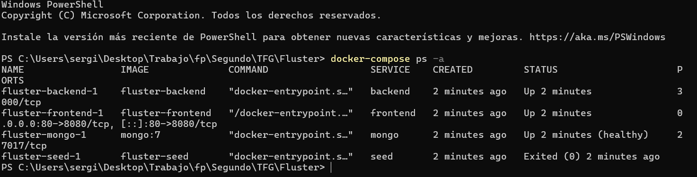
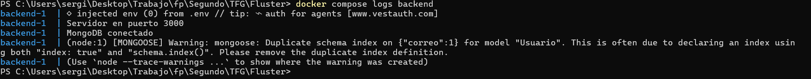
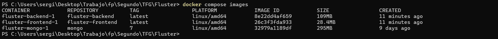
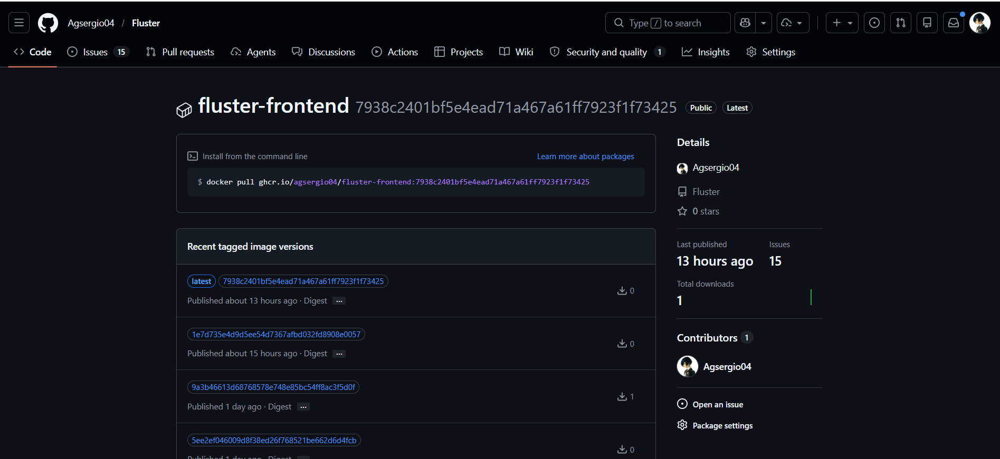
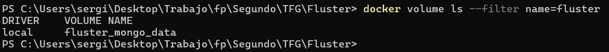
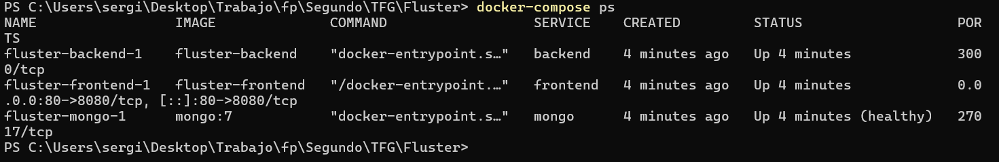
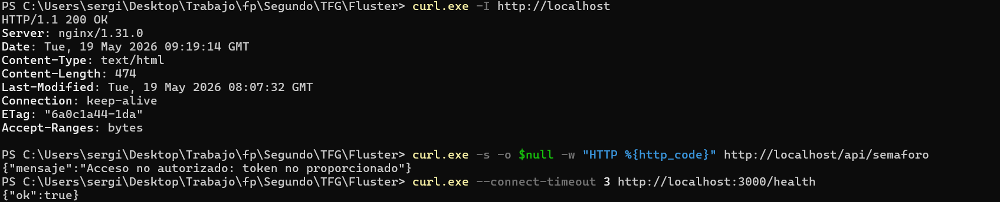
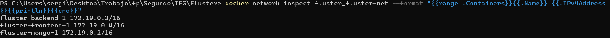

# Despliegue de la aplicación web — Fluster

Este apartado cubre los criterios de la rúbrica de **Despliegue de Aplicaciones Web** que aplican a este alumno:

- **C1 y C2** — criterios del RA1, pendiente de recuperación.
- **C7 y C8** — criterios obligatorios para todos los alumnos.

Para cada criterio se explica qué se ha implementado, dónde está en el repositorio y cómo se verifica su funcionamiento.

> Documentación técnica extendida disponible en [08-despliegue.md](./08-despliegue.md).

---

> ### Nota de recuperación — RA1 (Unidad 2: Docker y arquitectura)
>
> El **Resultado de Aprendizaje 1** (criterios **C1** y **C2**) está pendiente de recuperación. Estos dos criterios están especialmente desarrollados y evidenciados en este documento, incluyendo los ficheros reales del repositorio, justificación de cada decisión de diseño y secuencias de verificación paso a paso.

---

## Índice

1. [C1 — Arquitectura de la aplicación](#c1--arquitectura-de-la-aplicación) — RA1 pendiente
2. [C2 — Implementación Docker](#c2--implementación-docker) — RA1 pendiente
3. [C7 — Gestión de artefactos del despliegue](#c7--gestión-de-artefactos-del-despliegue) — obligatorio
4. [C8 — Verificación de red del despliegue](#c8--verificación-de-red-del-despliegue) — obligatorio

---

## C1 — Arquitectura de la aplicación

> **Criterio asociado al RA1 pendiente — especialmente detallado**

### Qué se ha implementado y por qué

La aplicación está dividida en **tres servicios completamente independientes**, cada uno con una responsabilidad única y bien delimitada. Esta separación sigue el principio de responsabilidad única y permite escalar, actualizar o reemplazar cualquier capa sin tocar las demás.

| Servicio | Tecnología | Responsabilidad | Puerto expuesto al host |
|---|---|---|---|
| `frontend` | React 19 + Vite + nginx-unprivileged:alpine | Sirve la SPA y actúa como reverse proxy | **80** (host) → 8080 (contenedor, no-root) |
| `backend` | Node.js 22 + Express 5 | API REST, lógica de negocio, autenticación JWT | Ninguno — solo red interna |
| `mongo` | MongoDB 7 | Persistencia de datos | Ninguno — solo red interna |

**Decisiones de diseño justificadas:**

- **Un solo punto de entrada (puerto 80):** el exterior solo puede hablar con nginx. El backend y MongoDB no están expuestos al host, lo que reduce la superficie de ataque y centraliza el acceso.
- **nginx como proxy inverso:** evita configurar CORS complejo en el backend y centraliza el enrutamiento. Las rutas `/api/*` se redirigen internamente sin que el navegador lo sepa.
- **Backend desacoplado del frontend:** el backend es una API REST pura (JSON), agnóstica de cómo se consuma. Se puede sustituir el frontend por una app móvil sin cambiar el backend.
- **MongoDB en volumen persistente:** los datos sobreviven a reinicios y recreaciones de contenedores. En producción se usa MongoDB Atlas, que añade replicación y backups automáticos.

### Diagrama de arquitectura

```
Navegador (cliente)
       │  HTTPS (Render) / HTTP en local
       ▼
┌──────────────────────────────────┐
│   frontend — nginx (no-root)     │  Puerto 80 (host) → 8080 (contenedor)
│                                  │
│   /              → index.html    │  (SPA React 19)
│   /assets/*      → bundle JS/CSS │
│   /*             → index.html    │  (React Router — client-side routing)
│   /api/*         ──────────────► │──┐
│   /api-docs/*    ──────────────► │──┤  proxy_pass
└──────────────────────────────────┘  │
                                      │ HTTP interno — red fluster-net
                                      ▼
┌──────────────────────────────────┐
│   backend — Node.js 22 + Express │  Puerto 3000 → solo red interna
│   JWT · BCrypt · Mongoose        │
│   Swagger UI · jsPDF · OCR       │
└──────────────────────────────────┘
       │ mongodb://mongo:27017/fluster
       │ red fluster-net
       ▼
┌──────────────────────────────────┐
│   mongo — MongoDB 7              │  Puerto 27017 → solo red interna
│   Volumen: mongo_data:/data/db   │
└──────────────────────────────────┘
```

**Comunicaciones:**
- El navegador envía peticiones solo a `frontend:80`. Nunca accede directamente al backend.
- nginx reenvía `/api/*` y `/api-docs/*` a `backend:3000` usando el nombre DNS interno de Docker.
- El backend accede a MongoDB con `mongodb://mongo:27017/fluster`. Docker resuelve `mongo` automáticamente dentro de `fluster-net`.
- MongoDB no recibe peticiones externas de ningún tipo.

### Fichero principal — [`docker-compose.yml`](../docker-compose.yml)

```yaml
services:

  # ─── Base de datos ────────────────────────────────────────────
  mongo:
    image: mongo:7
    restart: unless-stopped
    environment:
      MONGO_INITDB_DATABASE: fluster
    volumes:
      - mongo_data:/data/db
    networks:
      - fluster-net

  # ─── Backend ──────────────────────────────────────────────────
  backend:
    build:
      context: ./backend
      dockerfile: Dockerfile
    restart: unless-stopped
    environment:
      MONGO_URI:  mongodb://mongo:27017/fluster
      PORT:       3000
      JWT_SECRET: ${JWT_SECRET:-cambia_esto_por_un_secreto_seguro}
    depends_on:
      - mongo
    networks:
      - fluster-net

  # ─── Frontend ─────────────────────────────────────────────────
  frontend:
    build:
      context: ./frontend
      dockerfile: Dockerfile
    restart: unless-stopped
    ports:
      - "80:8080"
    depends_on:
      - backend
    networks:
      - fluster-net

volumes:
  mongo_data:

networks:
  fluster-net:
    driver: bridge
```

**Qué demuestra este fichero:**
- Solo `frontend` tiene `ports` — el único puerto expuesto al host es el 80.
- `backend` y `mongo` no tienen `ports` — solo accesibles dentro de `fluster-net`.
- `depends_on` garantiza el orden de arranque: mongo → backend → frontend.
- `restart: unless-stopped` recupera los servicios tras un reinicio del servidor.

### Verificación

```bash
docker compose up -d --build
docker compose ps
```

```
NAME                   IMAGE              STATUS    PORTS
fluster-frontend-1     fluster-frontend   running   0.0.0.0:80->8080/tcp
fluster-backend-1      fluster-backend    running
fluster-mongo-1        mongo:7            running
```

Solo `frontend` tiene puerto mapeado. `backend` y `mongo` sin puertos expuestos. La aplicación es accesible en `http://localhost`.

---

## C2 — Implementación Docker

> **Criterio asociado al RA1 pendiente — especialmente detallado**

### Qué se ha implementado

El proyecto está completamente dockerizado y es reproducible con un único comando (`docker compose up --build`) sin instalar Node.js, MongoDB ni ninguna otra dependencia en el sistema anfitrión.

### Dockerfile del backend — [`backend/Dockerfile`](../backend/Dockerfile)

```dockerfile
# ─── Imagen base más ligera disponible para Node ──────────────
FROM node:22-alpine

WORKDIR /app

# Instalar solo dependencias de producción
COPY package*.json ./
RUN npm ci --omit=dev

COPY src/ ./src/

# Ejecutar como usuario no-root (incluido en la imagen oficial de Node)
USER node

EXPOSE 3000

CMD ["node", "src/index.js"]
```

**Justificación línea a línea:**

| Instrucción | Por qué |
|---|---|
| `FROM node:22-alpine` | Alpine Linux reduce el tamaño (~50 MB vs ~350 MB de la imagen completa). Node 22 es la versión LTS activa. |
| `COPY package*.json` + `RUN npm ci --omit=dev` | Separar la instalación del código fuente aprovecha la caché de capas: si el código cambia pero `package.json` no, Docker reutiliza la capa de `node_modules`. `--omit=dev` excluye herramientas de desarrollo de la imagen final. |
| `COPY src/ ./src/` | Solo se copia el código fuente, no ficheros locales ni tests. |
| `CMD ["node", "src/index.js"]` | Forma `exec` (array): Node.js es el PID 1 del contenedor, lo que permite que Docker gestione correctamente las señales de parada (`SIGTERM`). |

### Dockerfile del frontend (multi-stage) — [`frontend/Dockerfile`](../frontend/Dockerfile)

```dockerfile
# ─── Fase 1: compilar el proyecto con Vite ────────────────────
FROM node:22-alpine AS builder

WORKDIR /app

COPY package*.json ./
RUN npm ci

COPY . .
RUN npm run build


# ─── Fase 2: servir el build con nginx (imagen no-root) ───────
FROM nginxinc/nginx-unprivileged:alpine

COPY --from=builder /app/dist /usr/share/nginx/html
COPY nginx/nginx.conf /etc/nginx/conf.d/default.conf

# Corre como el usuario "nginx" (UID 101), no como root
USER nginx

EXPOSE 8080

CMD ["nginx", "-g", "daemon off;"]
```

**Por qué build multi-stage:**

La imagen final no contiene Node.js, solo el bundle compilado y nginx.

- **Tamaño:** `nginx-unprivileged:alpine` pesa ~5 MB frente a ~50 MB de `node:22-alpine`. Node.js no es necesario en producción para servir ficheros estáticos.
- **Seguridad:** la imagen de producción no contiene código fuente React, ficheros de configuración de Vite ni `node_modules`. La superficie de ataque es mínima.
- **Sin privilegios:** ambos contenedores corren como usuario **no-root** (`node` en el backend, `nginx` en el frontend). nginx escucha en el puerto 8080 (un usuario no-root no puede usar puertos < 1024) y el host lo publica como 80. Esto cumple la recomendación de seguridad de no ejecutar procesos como root (Trivy DS-0002).

Fase 1 (builder): instala dependencias y ejecuta `npm run build`, produciendo `dist/` (HTML + JS + CSS optimizados). Fase 2: parte de cero con `nginx-unprivileged:alpine`, copia solo `dist/` y `nginx.conf`.

### Variables de entorno — [`backend/.env.example`](../backend/.env.example)

```dotenv
MONGO_URI=mongodb+srv://<usuario>:<contraseña>@cluster.mongodb.net/fluster
JWT_SECRET=cambia-esto-por-una-cadena-larga-y-aleatoria
PORT=3000
```

- El `.env.example` está en el repositorio como guía. No contiene credenciales reales.
- El `.env` real está en `.gitignore` y nunca se sube al repositorio.
- En producción (Render) los secretos se configuran como variables de entorno en el panel de la plataforma.

Extracto de [`.gitignore`](../.gitignore):
```
.env
*.env
!*.env.example
```

### Redes y volúmenes

**Red `fluster-net` (bridge):** los tres contenedores se comunican por nombre de servicio. Docker actúa como DNS interno. El tráfico nunca sale al exterior.

**Volumen `mongo_data`:** mapea `/data/db` del contenedor a un volumen gestionado por Docker. Los datos persisten entre reinicios. `docker compose down` no borra el volumen; `docker compose down -v` sí.

### Imagen publicada

Las imágenes se publican en cada push a `main` mediante el workflow [`docker.yml`](../.github/workflows/docker.yml), con dos tags: `latest` y el SHA corto del commit.

| Imagen | Registry |
|---|---|
| `fluster-backend` | `ghcr.io/agsergio04/fluster-backend:latest` |
| `fluster-frontend` | `ghcr.io/agsergio04/fluster-frontend:latest` |

### Verificación completa

```bash
# Levantar todos los servicios
docker compose up -d --build
```

```
[+] Building ...
 => [backend]  npm ci --omit=dev
 => [frontend builder] npm run build
 => [frontend] COPY --from=builder /app/dist ...
[+] Running 3/3
 - Container fluster-mongo-1     Started
 - Container fluster-backend-1   Started
 - Container fluster-frontend-1  Started
```

```bash
docker compose ps
```

```
NAME                   IMAGE              STATUS    PORTS
fluster-frontend-1     fluster-frontend   running   0.0.0.0:80->8080/tcp
fluster-backend-1      fluster-backend    running
fluster-mongo-1        mongo:7            running
```



```bash
# Logs de arranque del backend
docker compose logs backend
```

```
fluster-backend-1  | Servidor en puerto 3000
fluster-backend-1  | Conectado a MongoDB
```



```bash
# El backend responde a través del proxy nginx (sin token → 401, correcto)
curl -s -o /dev/null -w "HTTP %{http_code}\n" http://localhost/api/semaforo
# HTTP 401

# Health check del backend desde dentro de la red interna
docker compose exec backend node -e "fetch('http://localhost:3000/health').then(r=>r.json()).then(o=>console.log(o))"
# { ok: true }

# Frontend respondiendo
curl -I http://localhost
# HTTP/1.1 200 OK  —  Server: nginx/1.27.x
```

---

## C7 — Gestión de artefactos del despliegue

> **Criterio obligatorio para todos los alumnos** (RA4)

### Ficheros de orquestación y construcción

| Fichero | Ruta en el repo | Propósito | ¿En el repo? |
|---|---|---|---|
| `docker-compose.yml` | [`/docker-compose.yml`](../docker-compose.yml) | Define los 3 servicios, redes y volúmenes |  Sí |
| `Dockerfile` (backend) | [`/backend/Dockerfile`](../backend/Dockerfile) | Imagen del servidor Node.js |  Sí |
| `Dockerfile` (frontend) | [`/frontend/Dockerfile`](../frontend/Dockerfile) | Imagen multi-stage Vite + nginx |  Sí |
| `nginx.conf` | [`/frontend/nginx/nginx.conf`](../frontend/nginx/nginx.conf) | Configuración del servidor web y proxy |  Sí |

### Variables de entorno

| Fichero | Propósito | ¿En el repo? |
|---|---|---|
| [`/backend/.env.example`](../backend/.env.example) | Plantilla pública con las claves necesarias |  Sí |
| `/backend/.env` | Variables reales con secretos |  No — en `.gitignore` |

El `.env` real nunca se sube porque contiene `MONGO_URI` (con usuario/contraseña de MongoDB Atlas) y `JWT_SECRET`. El `.env.example` sirve de guía para quien clone el repositorio.

### Artefactos generados (no se suben)

| Artefacto | Dónde se genera | Cuándo |
|---|---|---|
| `frontend/dist/` | Build de Vite (`npm run build`) | En el Dockerfile fase builder o en CI |
| `node_modules/` | `npm ci` | En el Dockerfile o al desarrollar en local |

Estos directorios se generan automáticamente y no se suben al repositorio porque son derivados del código fuente.

### Imágenes Docker publicadas

Las imágenes se construyen y publican automáticamente por [`docker.yml`](../.github/workflows/docker.yml):

| Imagen | Registry | Tags |
|---|---|---|
| `fluster-backend` | `ghcr.io/agsergio04/fluster-backend` | `latest` + SHA corto del commit |
| `fluster-frontend` | `ghcr.io/agsergio04/fluster-frontend` | `latest` + SHA corto del commit |

Esto permite reproducir cualquier versión anterior por SHA: `docker pull ghcr.io/agsergio04/fluster-backend:a1b2c3d`






### Datos persistentes

| Dato | Dónde | Cómo se conserva |
|---|---|---|
| Base de datos MongoDB | Volumen `mongo_data` (local) / MongoDB Atlas (producción) | El volumen sobrevive a `docker compose down`. Atlas gestiona backups automáticos. |

Backup manual del volumen en un VPS:
```bash
docker run --rm -v fluster_mongo_data:/data -v $(pwd):/backup \
  alpine tar czf /backup/mongo-backup.tar.gz /data
```



### Resumen de artefactos

```
Repositorio GitHub (lo que SE sube)
├── docker-compose.yml         ← orquestación de servicios
├── backend/
│   ├── Dockerfile             ← imagen del backend
│   ├── .env.example           ← plantilla de variables (SIN secretos)
│   └── src/                   ← código fuente
└── frontend/
    ├── Dockerfile             ← imagen multi-stage del frontend
    ├── nginx/nginx.conf       ← configuración del proxy
    └── src/                   ← código fuente

Lo que NO se sube (generado o secreto)
├── backend/.env               ← secretos reales
├── frontend/dist/             ← bundle compilado (se genera en build)
└── node_modules/              ← dependencias (se instalan con npm ci)

Publicado en registries externos
├── ghcr.io/agsergio04/fluster-backend:latest
└── ghcr.io/agsergio04/fluster-frontend:latest
```

---

## C8 — Verificación de red del despliegue

> **Criterio obligatorio para todos los alumnos** (RA5)

### Topología de red

```
Internet
   │  TCP 443 — HTTPS gestionado por Render (producción)
   │  TCP 80  — HTTP en local
   ▼
nginx (frontend:80)  ←── único punto de entrada público
   │
   ├─── /              → index.html (SPA estática)
   ├─── /assets/*      → bundle JS/CSS
   ├─── /*             → index.html (React Router)
   ├─── /api/*         → proxy_pass → backend:3000
   └─── /api-docs/*    → proxy_pass → backend:3000
                                 │
                         red Docker fluster-net
                                 │
                             backend:3000 (Express)
                                 │
                        mongodb://mongo:27017
                                 │
                             mongo:27017
```

### Puertos publicados

| Contenedor | Puerto interno | Puerto expuesto al host | Accesible desde exterior |
|---|---|---|---|
| `frontend` (nginx) | 8080 | **80** | Si — único punto de entrada |
| `backend` (Node.js) | 3000 | Ninguno | No — solo red interna |
| `mongo` (MongoDB) | 27017 | Ninguno | No — solo red interna |

### Prueba 1 — estado de los servicios

```bash
docker compose ps
```

```
NAME                   IMAGE              STATUS    PORTS
fluster-frontend-1     fluster-frontend   running   0.0.0.0:80->8080/tcp
fluster-backend-1      fluster-backend    running
fluster-mongo-1        mongo:7            running
```

Solo `frontend` tiene un puerto mapeado al host (`0.0.0.0:80->8080/tcp`). `backend` y `mongo` no tienen puertos publicados.



### Prueba 2 — acceso al frontend

```bash
curl -I http://localhost
```

```
HTTP/1.1 200 OK
Server: nginx/1.27.4
Content-Type: text/html; charset=utf-8
```

nginx responde en el puerto 80 y sirve el `index.html` de la SPA.

### Prueba 3 — proxy a /api

```bash
curl -s -o /dev/null -w "HTTP %{http_code}\n" http://localhost/api/semaforo
```

```
HTTP 401
```

nginx recibió la petición en el puerto 80, la redirigió a `backend:3000` y el backend respondió 401 (sin token JWT — correcto). nginx actuó como proxy, no como respuesta directa.

### Prueba 4 — backend NO accesible directamente

```bash
curl -s --connect-timeout 3 http://localhost:3000/health
```

```
curl: (7) Failed to connect to localhost port 3000: Connection refused
```

El puerto 3000 no está expuesto al host. Solo es accesible dentro de `fluster-net`. Esta es la configuración correcta: el exterior solo llega al backend a través del proxy nginx.



### Prueba 5 — flujo completo (login real)

```bash
# Login a través del proxy
curl -s -X POST http://localhost/api/auth/login \
  -H "Content-Type: application/json" \
  -d '{"correo":"gestor@demo.com","contrasena":"demo1234"}'
```

```json
{
  "token": "eyJhbGciOiJIUzI1NiIsInR5cCI6IkpXVCJ9...",
  "usuario": { "nombre": "Gestor Demo", "rol": "gestor" }
}
```

```bash
# Usar el token para acceder a datos protegidos
TOKEN="eyJhbGciOiJIUzI1NiIsInR5cCI6IkpXVCJ9..."
curl -s http://localhost/api/semaforo \
  -H "Authorization: Bearer $TOKEN" | jq 'length'
# → 12
```

El flujo completo `cliente → nginx (80) → backend (3000) → MongoDB (27017)` funciona de extremo a extremo a través de `fluster-net`.

### Prueba 6 — resolución de nombres entre contenedores

```bash
docker exec fluster-backend-1 node -e \
  "require('dns').lookup('mongo', (e,a) => console.log(a))"
# → 172.18.0.2
```

Docker resuelve `mongo` a la IP interna del contenedor MongoDB. No se necesita `/etc/hosts` ni DNS externo; la red `fluster-net` lo gestiona automáticamente.



### Prueba 7 — producción con HTTPS (Render)

```bash
curl -I https://fluster-frontend.onrender.com
```

```
HTTP/2 200
server: nginx/1.27.4
content-type: text/html; charset=utf-8
```

```bash
# Health check del backend real (Web Service de Render)
curl -s https://fluster-vd09.onrender.com/health
# → {"ok":true}
```

En producción el mismo flujo funciona sobre HTTPS. Render termina TLS en su balanceador y reenvía la petición al servicio en HTTP interno.
