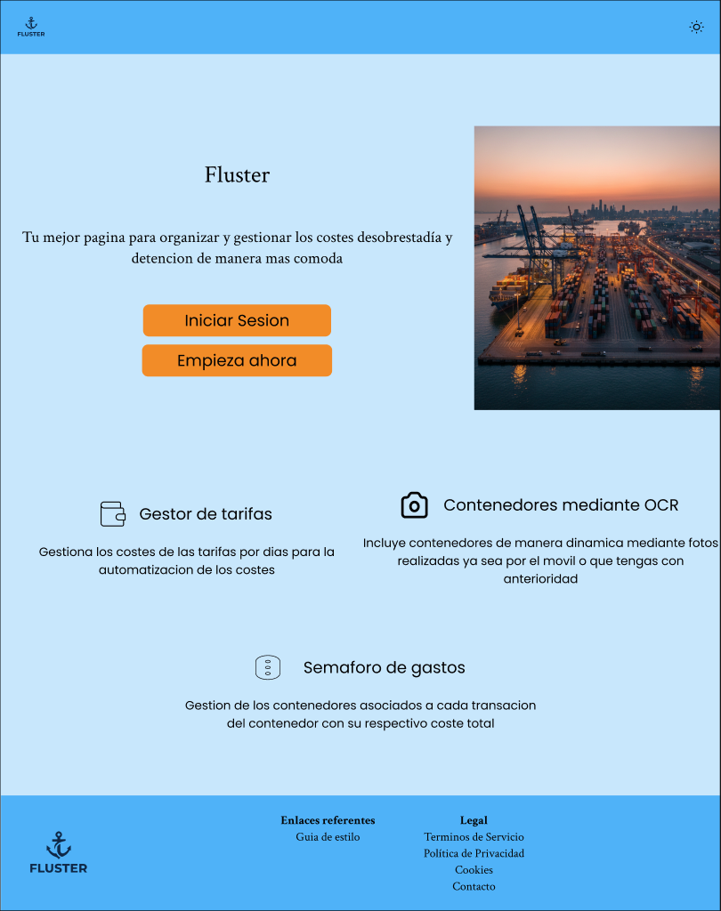
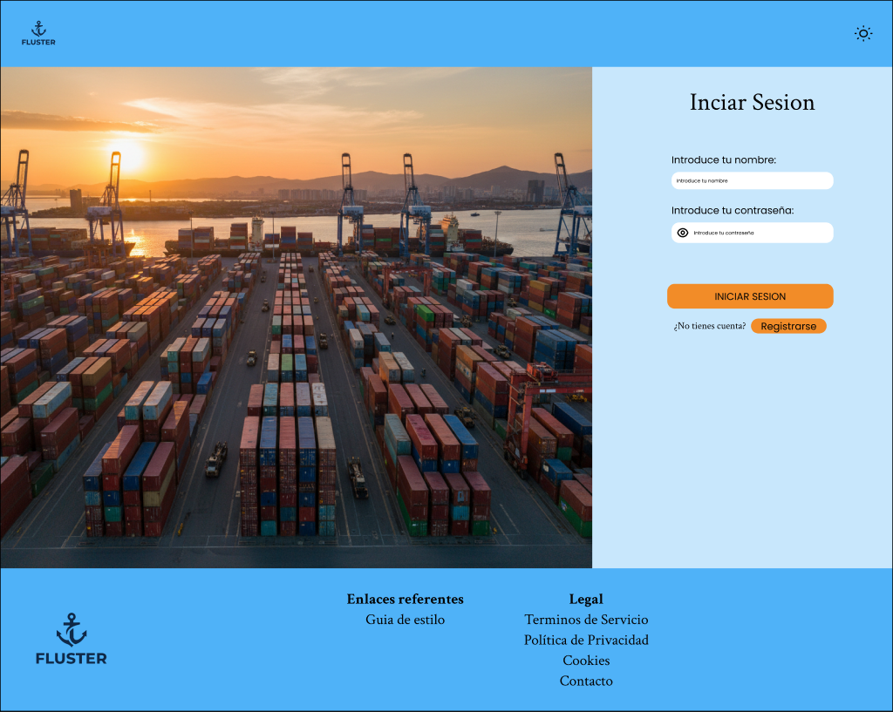
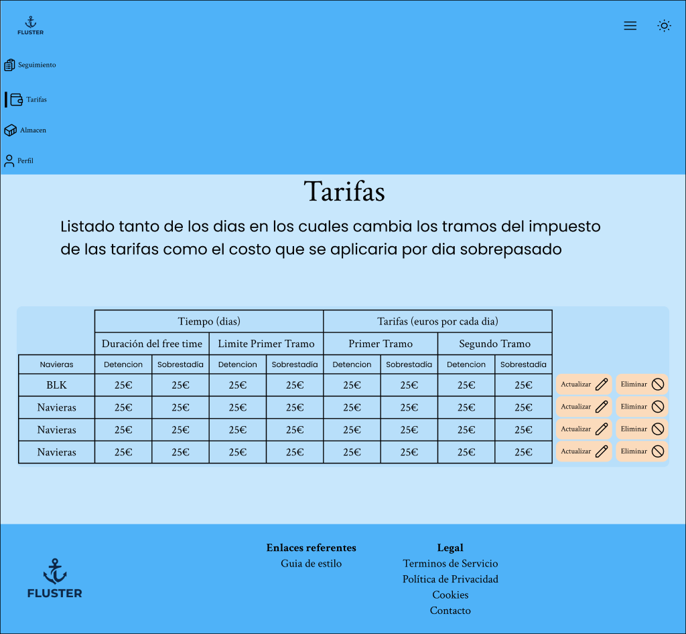
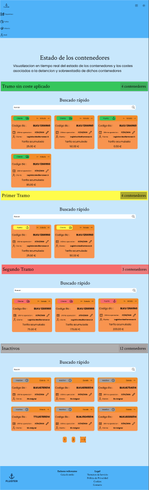
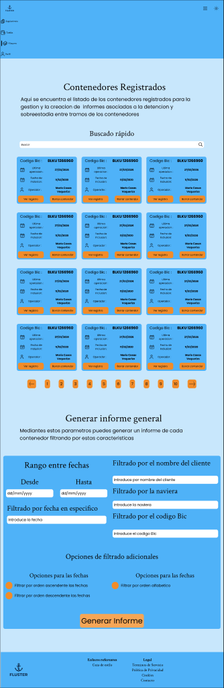
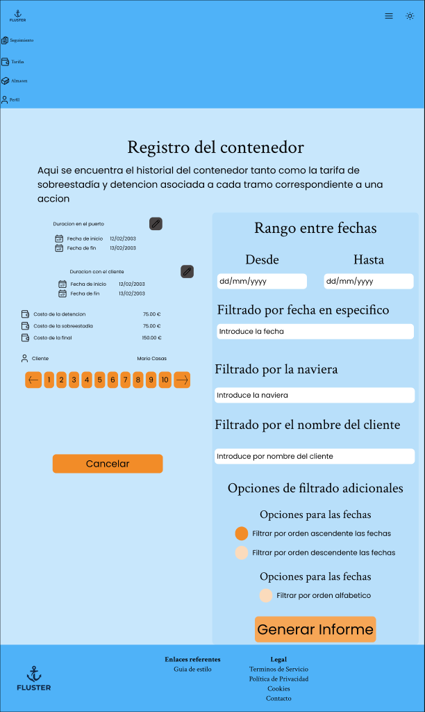
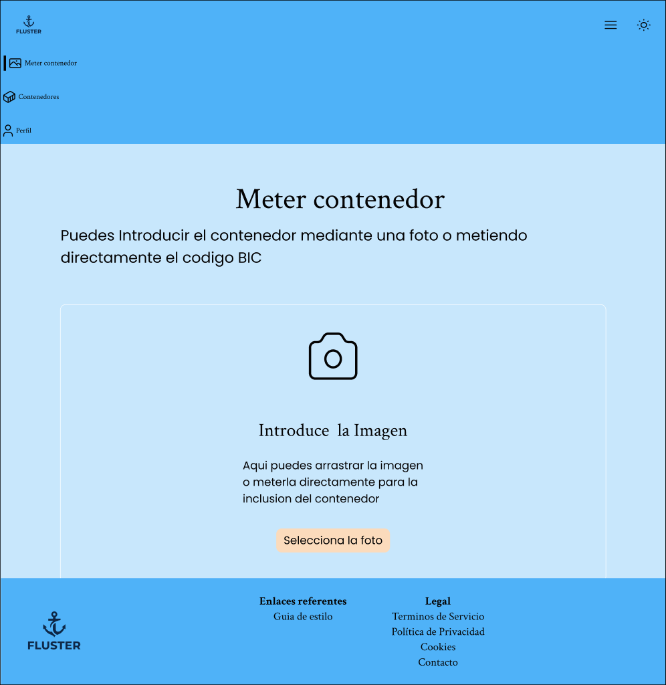
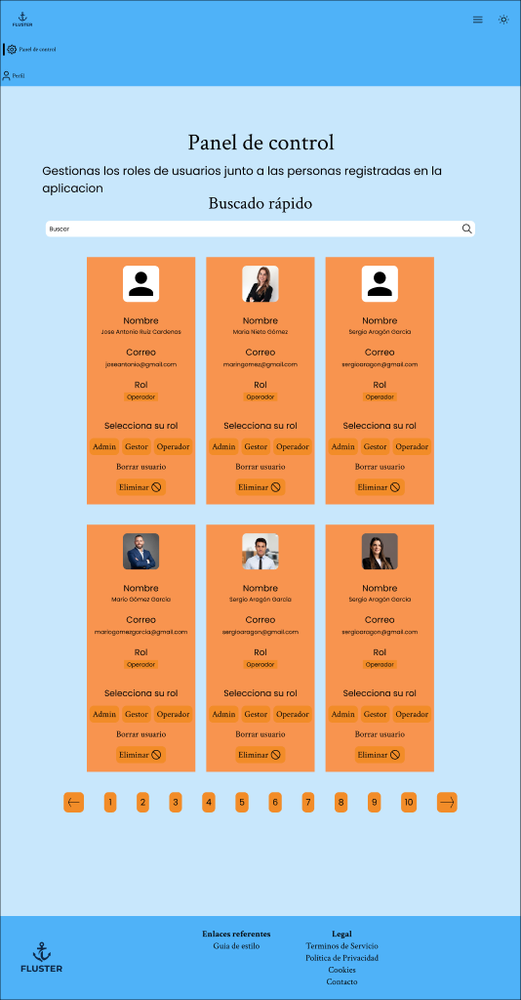
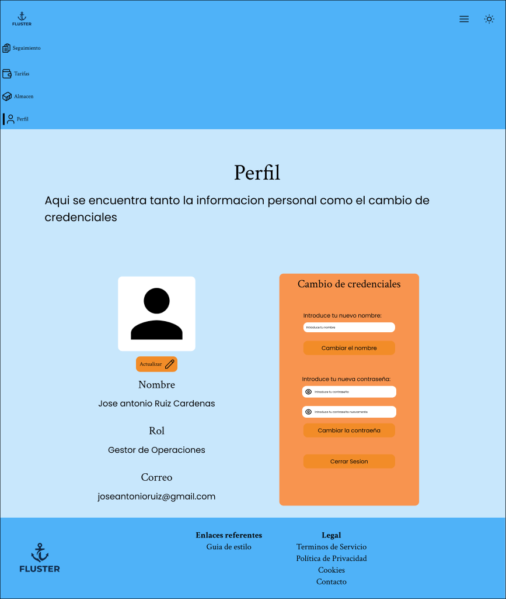

# 9. Manual de usuario

## 1. Acceso a la aplicación

**URL de la aplicación:** [https://fluster-frontend.onrender.com](https://fluster-frontend.onrender.com)

### 1.1 Iniciar sesión

1. Abre la URL en tu navegador. Llegarás a la página de inicio pública.
2. Haz clic en el botón **Iniciar sesión** o navega directamente a `/login`.
3. Introduce tu correo electrónico y tu contraseña.
4. Pulsa **Iniciar sesión**. Si las credenciales son correctas, serás redirigido automáticamente a la sección correspondiente a tu rol.

### 1.2 Crear una cuenta

1. En la pantalla de inicio de sesión, haz clic en el enlace **¿No tienes cuenta? Regístrate**.
2. Rellena el formulario con tu nombre, correo y contraseña.
3. Selecciona tu rol haciendo clic en uno de los dos botones:
   - **Soy un Operador** — introduzco contenedores mediante un sistema OCR.
   - **Soy Gestor de Operaciones** — controlo tarifas de navieras, gestiono los contenedores y genero los informes.
4. Pulsa **Crear cuenta**. Serás redirigido al login para iniciar sesión con tus nuevas credenciales.

### 1.3 Cerrar sesión

Desde cualquier página autenticada, accede a tu **perfil** (icono de usuario en la cabecera) y pulsa el botón **Cerrar sesión**. La sesión se elimina del navegador y eres redirigido a la página de inicio.

---

## 2. Manual del Gestor

El rol de gestor da acceso a las secciones de semáforo, almacén, tarifas e historial de contenedores.

### 2.1 Configurar una naviera y sus tarifas

1. Navega a la sección **Tarifas** (`/tarifas`) desde el menú de navegación.
2. Verás una tabla con todas las navieras registradas. Cada fila muestra el nombre/código de la naviera y sus parámetros tarifarios actuales.
3. Para editar una naviera, haz clic en el botón de editar de su fila. Los campos de la fila se vuelven editables.
4. Ajusta los valores que necesites:
   - **Días libres detention**: número de días gratuitos antes de que empiece a contar el detention.
   - **Días libres demurrage**: número de días gratuitos antes de que empiece a contar el demurrage.
   - **Hasta día (tramo 1)**: día límite del primer tramo tarifario.
   - **Precio/día tramo 1** (detention y demurrage por separado): importe diario dentro del primer tramo.
   - **Precio/día tramo 2** (detention y demurrage por separado): importe diario a partir del final del primer tramo.
5. Una vez revisados los valores, pulsa el botón de guardar. Los cambios se aplican de inmediato.
6. Para eliminar una naviera, pulsa el botón de eliminar en la misma fila y confirma la acción.

> **Nota:** el segundo tramo empieza automáticamente el día siguiente al «Hasta día» del tramo 1 y no tiene límite superior.

### 2.2 Revisar el semáforo de riesgo y gestionar transiciones

El semáforo (`/semaforo`) es la **pantalla principal de gestión operativa**. Desde aquí se visualizan todos los contenedores activos y se ejecutan todas las transiciones de estado.

1. Navega a la sección **Semáforo** (`/semaforo`) desde el menú de navegación.
2. La página muestra cuatro columnas con los contenedores agrupados según su situación de coste:

   | Columna | Color | Significado |
   |---|---|---|
   | **Sin costes** | Verde | El contenedor está dentro del periodo de días libres. No hay coste acumulado. |
   | **Primer tramo** | Amarillo | Ha superado los días libres y está acumulando coste al precio del primer tramo. |
   | **Segundo tramo** | Rojo | Ha superado el límite del primer tramo; el coste diario es más elevado. Requiere atención inmediata. |
   | **Inactivos** | Gris | Contenedores sin ciclo activo, a la espera de ser procesados. |

3. Cada tarjeta muestra el código BIC, el coste acumulado hasta hoy, el cliente asociado y la fecha de la última operación.
4. Usa el buscador de cada columna para localizar un contenedor concreto por código BIC.

#### Registrar la entrada a puerto (INACTIVO → PUERTO)

1. Localiza el contenedor en la columna **Inactivos**.
2. Haz clic en el botón «Siguiente» (flecha derecha) de su tarjeta.
3. Se abre el modal de entrada a puerto. Introduce el nombre del cliente asociado al contenedor.
4. Confirma. El cliente se crea automáticamente y el contenedor pasa a estado `PUERTO`. Comienza el cómputo de demurrage.

#### Registrar la salida a cliente (PUERTO → CLIENTE)

1. Localiza el contenedor en estado `PUERTO` (columna verde, amarilla o roja según los días transcurridos).
2. Haz clic en el botón «Siguiente» de su tarjeta.
3. El contenedor pasa a estado `CLIENTE` y comienza el cómputo de detention.

#### Revertir la salida a cliente (CLIENTE → PUERTO)

Si la salida se registró por error:

1. Localiza el contenedor en estado `CLIENTE`.
2. Haz clic en el botón «Anterior» de su tarjeta.
3. El contenedor vuelve a estado `PUERTO`.

#### Registrar la devolución (CLIENTE → VUELTA_PUERTO)

1. Localiza el contenedor en estado `CLIENTE`.
2. Haz clic en el botón «Siguiente» de su tarjeta.
3. El contenedor pasa a `VUELTA_PUERTO`, cerrando el ciclo activo.

#### Cancelar un ciclo activo (PUERTO → INACTIVO)

1. Localiza el contenedor en estado `PUERTO`.
2. Haz clic en el botón «Anterior» de su tarjeta.
3. Se cancela el ciclo y el contenedor regresa a `INACTIVO`.

#### Editar la fecha de inicio del período libre

1. En la tarjeta del contenedor en el semáforo, haz clic en el botón de editar fecha.
2. Introduce la nueva fecha en el modal que aparece.
3. Confirma. El cómputo de días se recalcula automáticamente a partir de la nueva fecha.

### 2.3 Gestionar el almacén

El almacén (`/almacen`) es una **vista de consulta y generación de informes**. No permite ejecutar transiciones de estado (eso se hace desde el semáforo).

1. Navega a la sección **Almacén** (`/almacen`) desde el menú de navegación.
2. Verás el listado paginado de todos los contenedores registrados en la plataforma, con su código BIC, estado, fecha de la última operación, fecha de inclusión y operador que los registró.
3. Usa el buscador para filtrar por código BIC.
4. Desde cada tarjeta de contenedor puedes:
   - **Ver registro**: accede al historial completo del contenedor (`/almacen/historial/:id`).
   - **Eliminar**: borra el contenedor del sistema (solo disponible si está en estado `INACTIVO`).

### 2.4 Ver el historial de un contenedor

1. Desde `/almacen`, localiza el contenedor y haz clic en **Ver registro**.
2. La página `/almacen/historial/:id` muestra el código BIC como título y, debajo, la lista de ciclos del contenedor paginados.
3. Para cada ciclo se muestra:
   - **Tramo Demurrage**: fecha de entrada a puerto, fecha de salida a cliente y coste calculado.
   - **Tramo Detention**: fecha de salida a cliente, fecha de devolución y coste calculado.
4. Para editar las fechas de un tramo manualmente:
   - Haz clic en el botón de editar del tramo correspondiente (Demurrage o Detention).
   - Ajusta la fecha de inicio y/o fin en el modal.
   - Guarda. El coste se recalcula automáticamente.

### 2.5 Generar un informe PDF

#### Informe individual (de un solo contenedor)

1. Accede al historial del contenedor (`/almacen/historial/:id`).
2. En el panel lateral derecho **Generar informe**, configura los filtros opcionales (rango de fechas, naviera, cliente, orden).
3. Pulsa **Generar informe**.
4. El archivo PDF se descarga automáticamente en tu navegador con el código BIC como nombre de fichero.

#### Informe general (de varios contenedores)

1. Navega a `/almacen`.
2. Desplázate hasta la sección **Generar informe general**, situada debajo del listado de contenedores.
3. Rellena los filtros que necesites: rango de fechas, fecha específica, naviera, cliente, código BIC y criterio de orden.
4. Pulsa **Generar informe**.
5. El PDF se descarga con un resumen de todos los ciclos que cumplen los filtros indicados.

### 2.6 Gestionar clientes

Los clientes se crean automáticamente al registrar la entrada a puerto de un contenedor: el modal de entrada a puerto solicita el nombre del cliente y lo registra en el sistema en ese mismo momento. No existe una pantalla independiente de gestión de clientes en la interfaz.

---

## 3. Manual del Operador

El rol de operador permite registrar nuevos contenedores y consultar los propios.

### 3.1 Registrar un nuevo contenedor

El formulario de registro solo requiere el **código BIC** del contenedor y, opcionalmente, una **foto** del mismo. El resto de datos (naviera, tarifa, cliente, días libres) los completará el gestor posteriormente.

1. Navega a **Meter contenedor** (`/meter-contenedor`) desde el menú de navegación.
2. Elige cómo quieres introducir el código BIC:

   **Opción A — Con fotografía (OCR):**
   1. Haz clic en **Seleccionar foto**.
   2. Elige una imagen del contenedor desde tu dispositivo (fotografía de la placa o del costado donde figura el código BIC).
   3. La aplicación procesa la imagen automáticamente con Tesseract OCR y rellena el campo con el código detectado.
   4. Verifica que el código es correcto y, si es necesario, corrígelo manualmente en el mismo campo.
   5. Pulsa **Introducir** para guardar el contenedor.

   **Opción B — Introducción manual:**
   1. Haz clic en **Introducir manualmente**.
   2. Escribe el código BIC directamente en el campo de texto.
   3. Pulsa **Introducir**.

3. Si el registro se completa correctamente, serás redirigido automáticamente a tu listado de contenedores (`/contenedores`).

> **Consejo:** si el OCR devuelve un código incorrecto o no detecta nada, el campo queda editable. Corrígelo a mano y pulsa «Introducir» sin necesidad de subir la foto de nuevo.

### 3.2 Ver mis contenedores

1. Navega a **Contenedores** (`/contenedores`) desde el menú de navegación.
2. Verás el listado paginado de todos los contenedores que has registrado.
3. Usa el buscador para filtrar por código BIC.
4. Cada tarjeta muestra el código BIC, la fecha de inclusión y la foto adjunta si la hay.
5. Para editar los datos básicos de un contenedor (fecha de inicio libre o foto), haz clic en el botón de editar de su tarjeta.

### 3.3 Eliminar un contenedor

1. En tu listado de contenedores (`/contenedores`), localiza el contenedor que deseas eliminar.
2. Haz clic en el botón de eliminar de su tarjeta.
3. Confirma la acción.

> **Atención:** solo es posible eliminar contenedores en estado `INACTIVO`. Si el contenedor ya ha iniciado un ciclo (está en puerto o con un cliente), debes ponerte en contacto con el gestor para que cancele el ciclo antes de poder eliminarlo.

---

## 4. Manual del Administrador

El rol de administrador da acceso exclusivo al panel de control de usuarios.

### 4.1 Acceder al panel de control

1. Inicia sesión con una cuenta con rol `admin`.
2. Navega a **Panel de control** (`/panel-de-control`) desde el menú de navegación.

### 4.2 Ver el listado de usuarios

1. En el panel de control verás todas las cuentas registradas en la plataforma, paginadas en tarjetas.
2. Cada tarjeta muestra el nombre, correo, foto de perfil y rol actual del usuario.
3. Usa el buscador para filtrar por nombre o correo electrónico.

### 4.3 Cambiar el rol de un usuario

Aunque los usuarios eligen su rol al registrarse, el administrador puede modificarlo posteriormente desde el panel de control.

1. Localiza la tarjeta del usuario cuyo rol quieres modificar.
2. Haz clic en el rol que deseas asignarle entre los botones disponibles: **gestor**, **operador** o **admin**.
3. El cambio se aplica de inmediato. El usuario verá las nuevas secciones disponibles la próxima vez que inicie sesión o recargue la aplicación.

> **Nota:** no es posible cambiar el rol de tu propia cuenta. Si necesitas hacerlo, pide a otro administrador que lo realice.

### 4.4 Eliminar un usuario

1. Localiza la tarjeta del usuario que deseas eliminar.
2. Haz clic en el botón **Eliminar** de su tarjeta.
3. Confirma la acción. La cuenta queda borrada del sistema de forma permanente.

> **Atención:** la eliminación de un usuario es irreversible. Los contenedores registrados por ese usuario permanecen en el sistema.

---

## 5. Gestión del perfil (todos los roles)

Cualquier usuario autenticado puede gestionar su perfil accediendo a `/perfil` desde el icono de usuario en la cabecera.

### 5.1 Cambiar el nombre de visualización

1. En la sección **Cambiar nombre**, escribe tu nuevo nombre en el campo de texto.
2. Pulsa **Confirmar**. El nuevo nombre aparecerá en la cabecera y en tu tarjeta de usuario.

### 5.2 Cambiar la contraseña

1. En la sección **Cambiar contraseña**, introduce tu contraseña actual en el primer campo.
2. Escribe la nueva contraseña en el segundo campo.
3. Repite la nueva contraseña en el tercer campo para confirmarla.
4. Pulsa **Confirmar**. Si la contraseña actual es correcta y las nuevas coinciden, el cambio se aplica de inmediato.

> **Consejo:** si olvidas tu contraseña actual, contacta con tu administrador para que elimine y vuelva a crear tu cuenta.

### 5.3 Actualizar la foto de perfil

1. En la sección de perfil, haz clic sobre tu foto actual o sobre el área de imagen.
2. Selecciona una imagen desde tu dispositivo.
3. La foto se actualiza automáticamente y quedará visible en la cabecera y en el panel de control.

---

## 6. Preguntas frecuentes

**¿Qué pasa si el OCR no lee bien el código BIC?**
El campo de código BIC siempre puede editarse manualmente antes de confirmar el registro. Si la lectura automática devuelve un resultado incorrecto o parcial, simplemente corrígelo a mano en el mismo campo y pulsa «Introducir». No es necesario subir la foto de nuevo.

**¿Puedo revertir una transición de estado?**
Solo la transición de salida a cliente (`PUERTO → CLIENTE`) puede revertirse. Para ello, pulsa el botón «Anterior» en la tarjeta del contenedor mientras está en estado `CLIENTE`. El resto de transiciones (entrada a puerto, devolución) no tienen marcha atrás; en su lugar, usa la opción «Cancelar ciclo» si necesitas anular todo el ciclo activo.

**¿Cómo sé cuánto está costando un contenedor en este momento?**
Accede a la página **Semáforo** (`/semaforo`). Cada tarjeta de contenedor activo muestra el coste acumulado hasta el día de hoy, calculado en tiempo real según las tarifas configuradas para su naviera. Para ver el desglose por tramos y periodos, accede al historial desde el almacén.

**¿Los informes PDF reflejan cambios posteriores en las tarifas?**
No. Los informes son instantáneas del momento en que se generan. Si después de generar un informe modificas las tarifas de una naviera, el PDF ya descargado no cambia. Para obtener un informe actualizado con las nuevas tarifas, genera uno nuevo.

**¿Qué ocurre si registro un contenedor con un código BIC incorrecto?**
Si el contenedor está en estado `INACTIVO` (aún no ha iniciado ciclo), puedes eliminarlo desde `/contenedores` y registrarlo de nuevo con el código correcto. Si ya ha iniciado un ciclo, contacta con el gestor para cancelar el ciclo y, a continuación, elimina y vuelve a crear el contenedor.

